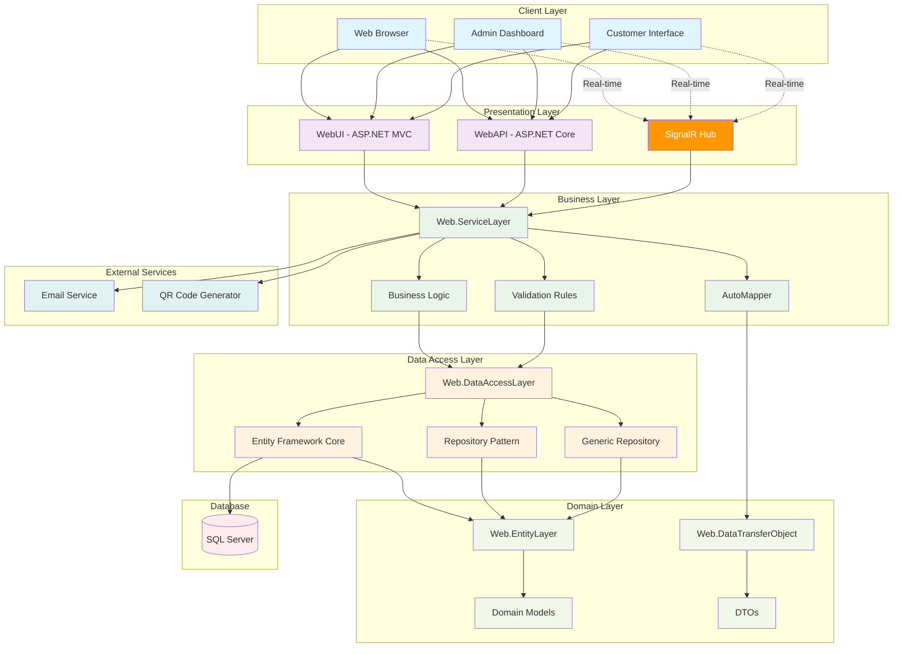

# 🍽️ SignalR Restaurant Management System

A comprehensive, real-time restaurant management system built with ASP.NET Core, SignalR, and modern web technologies. This system provides real-time updates for table management, orders, reservations, and administrative dashboards.

## 🏗️ Software Architecture



## ✨ Key Features

### 🔄 Real-Time Features (SignalR)
- **Live Dashboard Updates**: Real-time statistics and analytics
- **Table Status Management**: Instant table availability updates
- **Notification System**: Real-time notifications for staff
- **Order Tracking**: Live order status updates
- **Client Connection Monitoring**: Track active users
- **Chat System**: Real-time communication between staff

### 🏪 Restaurant Management
- **Table Management**: Create, update, and monitor table availability
- **Food & Category Management**: Complete menu management system
- **Order Processing**: Full order lifecycle management
- **Reservation System**: Customer reservation handling
- **Inventory Tracking**: Monitor food items and availability

### 👨‍💼 Administrative Features
- **Comprehensive Dashboard**: Real-time analytics and KPIs
- **User Authentication**: Secure login system with role-based access
- **Content Management**: Manage sliders, testimonials, and website content
- **Email Integration**: Automated email notifications
- **QR Code Generation**: Generate QR codes for table orders
- **Report Generation**: Business intelligence and reporting

### 🎨 User Interface
- **Responsive Design**: Mobile-friendly admin panel and customer interface
- **Modern UI/UX**: Clean and intuitive interface design
- **Admin Panel**: Feature-rich administrative dashboard
- **Customer Portal**: User-friendly ordering and reservation system

## 🛠️ Technologies Used

### Backend Technologies
- **ASP.NET Core 8.0** - Web framework
- **SignalR** - Real-time communication
- **Entity Framework Core** - ORM for database operations
- **SQL Server** - Primary database
- **AutoMapper** - Object-to-object mapping
- **FluentValidation** - Input validation
- **ASP.NET Core Identity** - Authentication and authorization

### Frontend Technologies
- **ASP.NET MVC** - Server-side rendering
- **HTML5/CSS3** - Modern web standards
- **JavaScript** - Client-side functionality
- **Bootstrap** - Responsive UI framework
- **SignalR JavaScript Client** - Real-time communication

### Architecture Patterns
- **Clean Architecture** - Separation of concerns
- **Repository Pattern** - Data access abstraction
- **Dependency Injection** - Inversion of control
- **CQRS Principles** - Command and query separation
- **DTO Pattern** - Data transfer objects

## 📁 Project Structure

```
SignalR_Restaurant/
├── 📂 Web.EntityLayer/           # Domain entities and models
│   └── Entities/                 # Core business entities
├── 📂 Web.DataAccessLayer/       # Data access layer
│   ├── Abstract/                 # Data access interfaces
│   ├── Concrete/                 # Database context
│   ├── EntityFramework/          # EF implementations
│   └── Repositories/             # Generic repository
├── 📂 Web.DataTransferObject/    # Data transfer objects
│   └── [Entity]DTO/              # DTOs for each entity
├── 📂 Web.ServiceLayer/          # Business logic layer
│   ├── Abstract/                 # Service interfaces
│   ├── Concrete/                 # Service implementations
│   └── ValidationRules/          # FluentValidation rules
├── 📂 WebAPI/                    # REST API layer
│   ├── Controllers/              # API controllers
│   ├── Hubs/                     # SignalR hubs
│   ├── Mapping/                  # AutoMapper profiles
│   └── SignalRDTO/               # SignalR-specific DTOs
└── 📂 WebUI/                     # Web application
    ├── Areas/Admin/              # Admin panel
    ├── Controllers/              # MVC controllers
    ├── Views/                    # Razor views
    ├── ViewComponents/           # View components
    └── wwwroot/                  # Static files
```

## 🚀 Getting Started

### Prerequisites
- .NET 8.0 SDK or later
- SQL Server 2019 or later (LocalDB for development)
- Visual Studio 2022 or Visual Studio Code
- Git

### Installation Steps

1. **Clone the repository**
   ```bash
   git clone https://github.com/korayciftciii/SignalR_Project.git
   cd SignalR_Project
   ```

2. **Restore NuGet packages**
   ```bash
   dotnet restore
   ```

3. **Update database connection string**
   - Update `appsettings.json` in both WebAPI and WebUI projects
   - Configure your SQL Server connection string

4. **Run database migrations**
   ```bash
   cd Web.DataAccessLayer
   dotnet ef database update
   ```

5. **Start the applications**
   
   **Option 1: Using Visual Studio**
   - Set multiple startup projects (WebAPI and WebUI)
   - Press F5 to run

   **Option 2: Using command line**
   ```bash
   # Terminal 1 - Start WebAPI
   cd WebAPI
   dotnet run
   
   # Terminal 2 - Start WebUI
   cd WebUI
   dotnet run
   ```

6. **Access the application**
   - **Web Application**: https://localhost:7156
   - **API Documentation**: https://localhost:7295/swagger
   - **Admin Panel**: https://localhost:7156/Admin

### Default Configuration
- **API Port**: 7295 (HTTPS), 5295 (HTTP)
- **Web UI Port**: 7156 (HTTPS), 5156 (HTTP)
- **SignalR Hub**: `/signalrhub`

## 📡 API Documentation

### Core Endpoints

#### Restaurant Tables
- `GET /api/v1/RestaurantTable` - Get all tables
- `PUT /api/v1/RestaurantTable/ToggleTableStatusToTrue/{id}` - Mark table as available
- `PUT /api/v1/RestaurantTable/ToggleTableStatusToFalse/{id}` - Mark table as occupied

#### Food Management
- `GET /api/v1/Food` - Get all food items
- `GET /api/v1/Food/FoodGetWithCategory` - Get foods with categories
- `GET /api/v1/Food/FoodCount` - Get total food count
- `POST /api/v1/Food` - Create new food item

#### Orders
- `GET /api/v1/Order` - Get all orders
- `GET /api/v1/Order/OrderCount` - Get total order count
- `GET /api/v1/Order/DailyIncome` - Get daily revenue
- `POST /api/v1/Order` - Create new order

#### Reservations
- `GET /api/v1/Reservation` - Get all reservations
- `POST /api/v1/Reservation` - Create new reservation
- `PUT /api/v1/Reservation/{id}` - Update reservation

### SignalR Hub Methods

#### Server Methods
- `GetAllDashboardData()` - Get real-time dashboard statistics
- `GetReservationList()` - Get live reservation updates
- `GetNotificationCounts()` - Get notification counters
- `GetAvailableTables()` - Get available tables
- `GetOccupiedTables()` - Get occupied tables
- `SendMessage(user, message)` - Send chat message

#### Client Events
- `ReceiveAllDashboardData` - Dashboard data updates
- `ReceiveReservationList` - Reservation list updates
- `ReceiveNotificationCount` - Notification count updates
- `ReceiveAvailableTables` - Available table updates
- `ReceiveOccupiedTables` - Occupied table updates
- `RecieveMessage` - Chat message received
- `RecieveClientCount` - Active client count

## 🔧 Configuration

### Database Configuration
Update the connection string in `appsettings.json`:

```json
{
  "ConnectionStrings": {
    "DefaultConnection": "Server=(localdb)\\MSSQLLocalDB;Database=RestaurantDB;Trusted_Connection=true"
  }
}
```

### CORS Configuration
For development, CORS is configured to allow all origins. For production, update the CORS policy in `Program.cs`:

```csharp
builder.Services.AddCors(options =>
{
    options.AddPolicy("CorsPolicy", builder => {
        builder.WithOrigins("https://yourdomain.com")
               .AllowAnyMethod()
               .AllowAnyHeader()
               .AllowCredentials();
    });
});
```

## 🤝 Contributing

1. Fork the repository
2. Create your feature branch (`git checkout -b feature/AmazingFeature`)
3. Commit your changes (`git commit -m 'Add some AmazingFeature'`)
4. Push to the branch (`git push origin feature/AmazingFeature`)
5. Open a Pull Request

## 📞 Contact Information

- **Developer**: Koray Çiftçi
- **Email**: [ciftci.koray@outlook.com](mailto:ciftci.koray@outlook.com)
- **Portfolio**: [https://korayciftci.vercel.app/](https://korayciftci.vercel.app/)
- **GitHub Repository**: [https://github.com/korayciftciii/SignalR_Project](https://github.com/korayciftciii/SignalR_Project)

## 📄 License

This project is licensed under the MIT License - see the [LICENSE.txt](LICENSE.txt) file for details.

## 🙏 Acknowledgments

- Built with ❤️ using ASP.NET Core and SignalR
- Special thanks to the Microsoft .NET team for excellent documentation
- Icons and design inspiration from various open-source projects

---

**⭐ If you find this project helpful, please give it a star!**